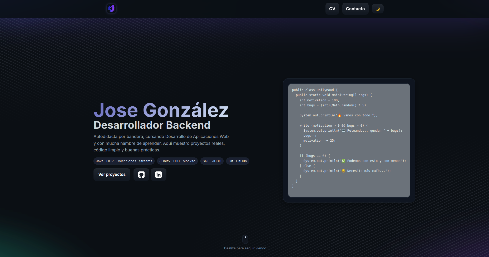

# Jose González · Desarrollador Backend — Portfolio


<p align="center">
  <a href="https://jossegonnza.vercel.app/">Demo</a> ·
  <a href="#instalacion">Instalación</a> ·
  <a href="#tecnologias">Tecnologías</a> ·
  <a href="#contribuir">Contribuir</a> ·
  <a href="#contacto">Contacto</a> 
</p>

---

## Badges

 · 
 · 
 · 
 · 


## Vista previa




## Visión general

Portfolio personal minimalista y rápido, orientado a **backend Java**, **TDD** y **APIs**. Incluye sección de proyectos, skills, enlaces a GitHub/LinkedIn y formulario de contacto (redirección mailto/servicio externo).

* **SEO listo**: metadatos OG/Twitter, favicon y `site.webmanifest`.
* **Modo oscuro** con persistencia en `localStorage`.
* **Accesible**: navegación por teclado, `skip-link`, `aria-pressed`, foco visible.
* **Rendimiento**: CSS/JS separados, imágenes optimizadas.

## Características

- Animaciones suaves y scroll reveal personalizado
- Modo oscuro/claro con persistencia
- Hero animado con snippet de código
- Sección de proyectos nivel estudio de caso
- Sistema de filtrado (chips) en Aprendizaje
- Accesibilidad cuidada (teclado + aria)
- CI configurado con GitHub Actions


## Tecnologías

* **Frontend**: HTML5, CSS3, JavaScript
* **Build** (opcional): ninguna; sirve como sitio estático. Puedes usar `npm http-server` o VS Code Live Server.
* **Infra**: Vercel (deploy automático desde GitHub)


## Instalación

### Ejecutar en local

```bash
# Clona el repo
git clone https://github.com/JosseGonnza/Portfolio25.git
cd Portfolio25

# Opción A: Live Server (VS Code)
# Clic derecho en index.html → "Open with Live Server"

# Opción B: http-server
npx http-server -p 5173
# Abre http://localhost:5173
```

## Contribuir

1. Haz un fork
2. Crea rama: `git checkout -b feature/mi-mejora`
3. Commit: `git commit -m "feat: mejora X"`
4. Push: `git push origin feature/mi-mejora`
5. Abre PR


## Contacto

* **Web**: [Demo Portfolio](https://jossegonnza.vercel.app/)
* **LinkedIn**: [Jose M. González Quevedo](https://www.linkedin.com/in/jossegonnza/)
* **GitHub**: [JosseGonnza](https://github.com/JosseGonnza)
* **Email**: [accion.quevedo@gmail.com](mailto:accion.quevedo@gmail.com)

---
